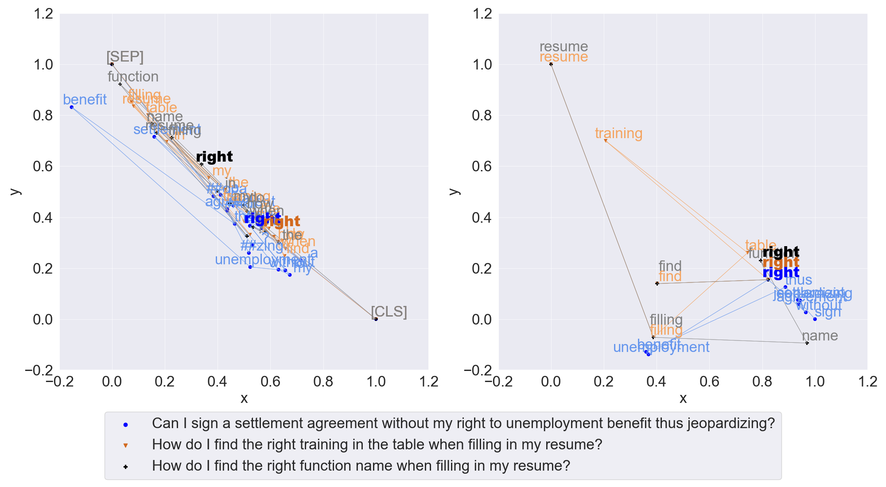

# TAPPBERT: Text-Aware Process Prediction with BERT

This repository contains the source code for the paper 'Text-Aware Predictive Process Monitoring with Contextualized Word Embeddings'.

It contains the implementation of a text-aware process prediction technique using contextualized word embeddings from BERT, hence the name TAPPBERT. TAPPBERT can capture semantic context in text, namely the meaning attributed to words due to the content of texts rather than by their customary linguistic definitions. 

The implementation of TAPPBERT is based on the source code of [Pegoraro et al. (2021)](https://arxiv.org/abs/2104.09962).
The underlying model architecture was first proposed by [Tax et al. (2017)](https://arxiv.org/abs/1612.02130).

## How to use TAPPBERT?
### Setup
1. Create a virtual environment
2. Install the required python packages (requirements.txt) through the command "pip install -r requirements.txt" from the repository root directory 
3. Load event log files (.xes) in a directory ``./datasets/``
4. In ``./src/evaluate.py``, specify the text model used to generate word embeddings for text features in event logs (lines 132-160)
5. Execute the script ``./src/evaluate.py`` with parameters "log", "attributes" (``-a``), and "text" (``-t``) set 
(e.g. ``./datasets/werk.xes -a age gender -t question``)

### Datasets
We include the *Customer Journey* event log used to evaluate TAPPBERT (``./datasets/werk.xes``)

### Results
The results of all experiments conducted are stored in (``./results/results_werk_paper.csv``)

### Technical Details
This method was implemented in Python 3.8 using the deep learning frameworks TensorFlow and PyTorch, and the Hugging Face library to utilize pre-trained BERT models. 

We conducted all experiments on a workstation with 12 CPUs, 128 GB RAM and a single Quadro RTX 6000 GPU.

### Comparing non-contextualized to contextualized word embeddings
To emphasize the difference between non-contextualized and contextualized word embeddings, it is helpful to visualize the word embedding vectors they generate in a vector space.
As an example, the figure below illustrates the embeddings of TAPPBERT (4) (see Paper for further details) compared to Doc2Vec (with vector size 100) for three sentences from the *Customer Journey* event log.

*TAPPBERT (4) (left) and Doc2Vec 100 (right) embeddings in 2D vector space.*

  The word embedding vectors are reduced to two dimensions to make them visible in a 2D vector space which is easy for the human eye to comprehend.
  All three depicted sentences contain the word "right", which has different meanings depending on the context it appears in.
  In the first sentence (blue), the word is used as a noun to express a legal principle of entitlement, whereas it appears in the second (yellow) and third (black) sentence in the form of an adverb as an expression of correctness.
  We can see from the figure that BERT generates different "right"-vectors for all three sentences. 
  In contrast, Doc2Vec encodes the word "right" with a vector representation identical for the three sentences.
  The visualization confirms the notion of contextualized word embeddings by reflecting the whole sentence in a single word's vector representation.
  
Note: The original BERT proposed by [Devlin et al. (2019)](https://arxiv.org/abs/1810.04805) uses a maximum sequence length of 512 tokens, truncating longer sequences automatically. For most cases, this option is sufficient.
